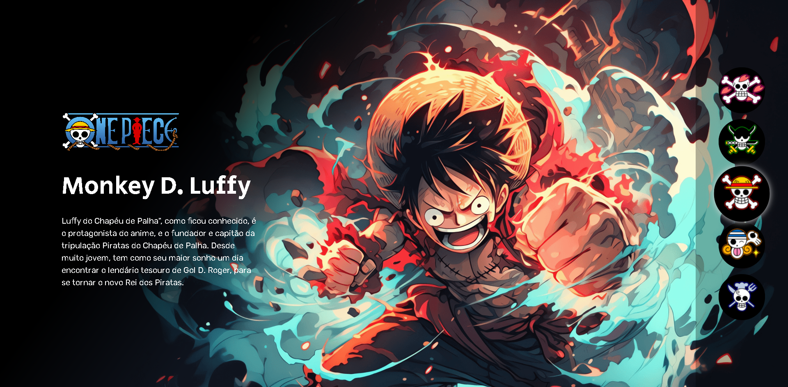

**One Piece - DEV EM DOBRO**

# One Piece

**Descrição**

Projeto desenvolvido durante o evento "Do Zero ao Programador Contratado" - Dev Em Dobro
- Tema Adaptado - [Spy x Family](https://github.com/Sinddylnn/Spy-x-Family)

**Recursos Principais**

- **Design Responsivo:** Adapta-se perfeitamente a uma variedade de dispositivos, proporcionando uma experiência consistente.
- **Navegação Intuitiva:** Interface de usuário fácil de usar, tornando a navegação uma experiência fluida.

**Captura de Tela**

**Instalação e Uso**

Não é necessário instalação. Basta acessar [One Piece](https://sinddylnn.github.io/One-Piece/) para explorar todas as funcionalidades.

**Tecnologias**
- HTML
- CSS
- JavaScript

**Contato**

- Email: sinddylnn@gmail.com
- Linkedin: [@sinddylnn](https://www.linkedin.com/in/sinddylnn/)
